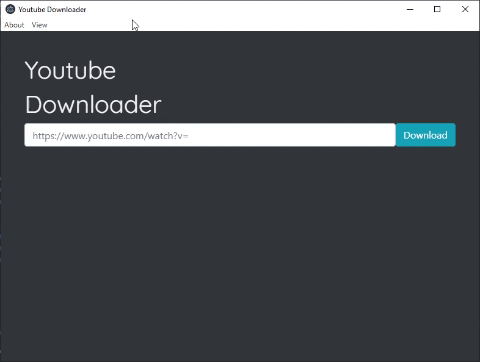

# Youtube Downloader

The Youtube Downloader is an app that was created using ElectronJS and the youtube-dl npm package.
It is exactly what it sounds like. You input a youtube video URL and click download.

### Download

To download please go to the [releases](https://github.com/baysik/Youtube-Downloader/releases) section of this repo and download the latest recent .exe.

##### This app was created using:

- ElectronJS
- electron-updater
- electron-store
- youtube-dl
- Bootstrap 4
